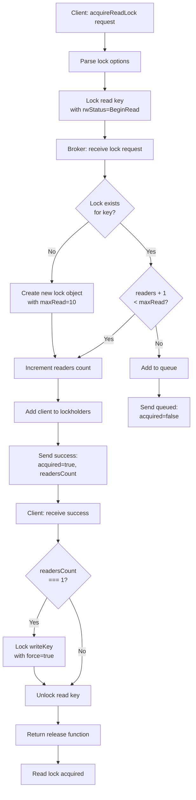
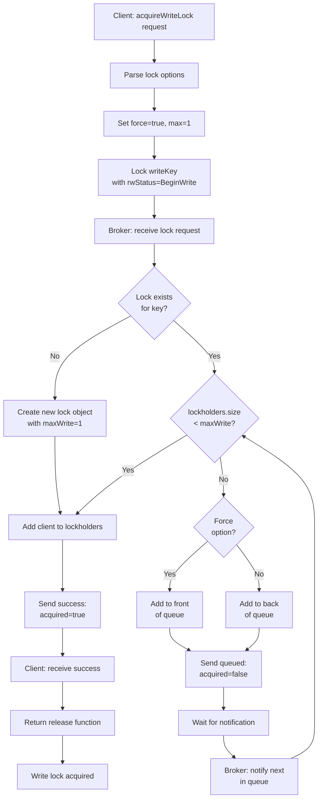
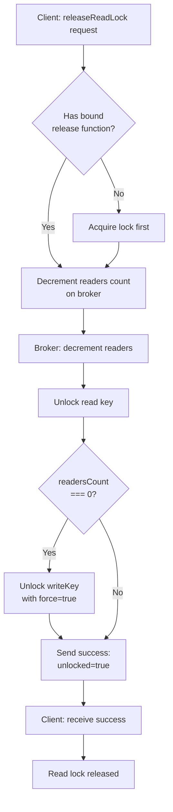
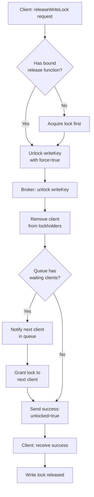

# Reader-Writer Lock Decision Tree (Read-Preferring)

This document shows the decision flow for how clients and the broker handle reader-writer locks with read preference. Multiple readers can coexist, but writers are exclusive and wait for all readers to finish.

## Acquire Read Lock Flow

## Acquire Write Lock Flow

## Release Read Lock Flow

## Release Write Lock Flow

