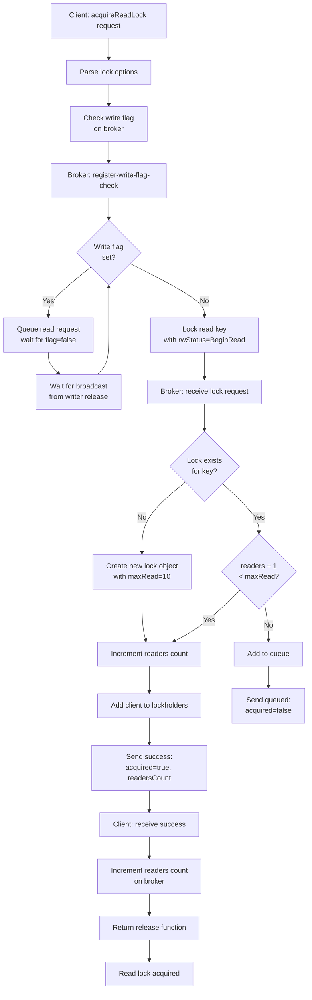
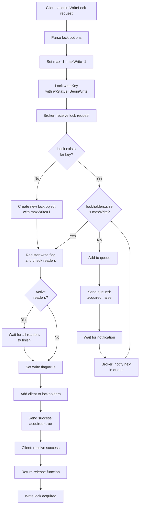
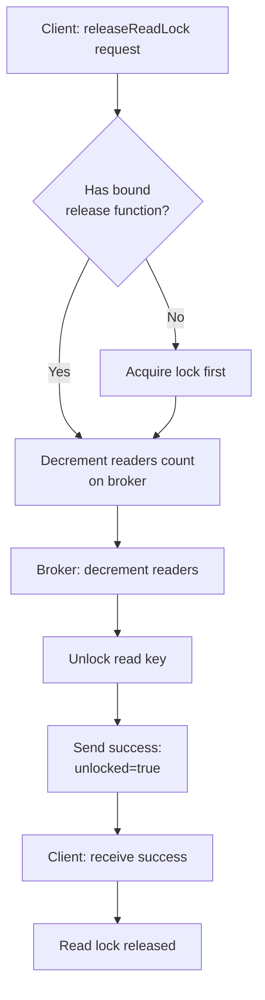
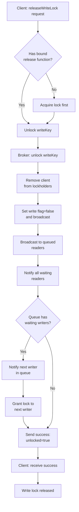

# Reader-Writer Lock Decision Tree (Write-Preferring)

This document shows the decision flow for how clients and the broker handle reader-writer locks with write preference. Writers have priority and block new readers from acquiring locks.

## Acquire Read Lock Flow

## Acquire Write Lock Flow

## Release Read Lock Flow

## Release Write Lock Flow

