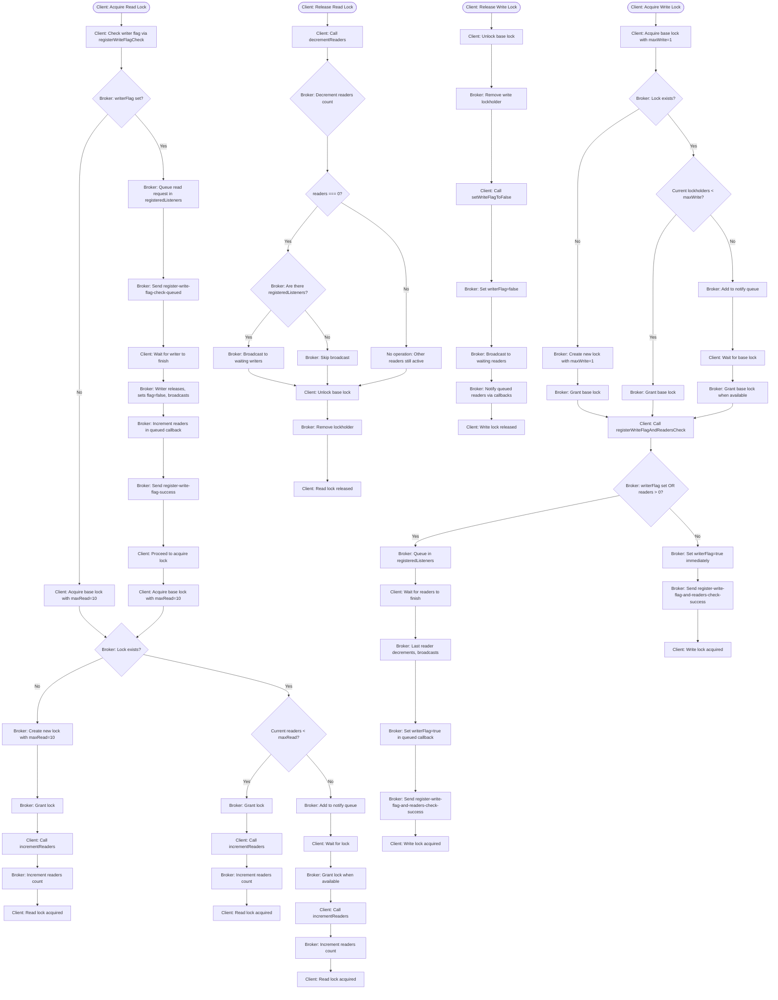

# Reader-Writer Write-Preferred Lock Decision Tree

This document shows the decision tree for how clients and broker handle write-preferred reader-writer lock acquisition and release.

```mermaid
flowchart TD
    StartRead([Client: Acquire Read Lock]) --> CheckWriterFlag[Client: Check writer flag via registerWriteFlagCheck]
    CheckWriterFlag --> BrokerCheckFlag{Broker: writerFlag set?}
    
    BrokerCheckFlag -->|Yes| QueueRead[Broker: Queue read request in registeredListeners]
    QueueRead --> SendQueued[Broker: Send register-write-flag-check-queued]
    SendQueued --> WaitForWriter[Client: Wait for writer to finish]
    WaitForWriter --> WriterDone[Broker: Writer releases, sets flag=false, broadcasts]
    WriterDone --> IncrementReadersQueued[Broker: Increment readers in queued callback]
    IncrementReadersQueued --> SendSuccessQueued[Broker: Send register-write-flag-success]
    SendSuccessQueued --> AcquireLockQueued[Client: Proceed to acquire lock]
    
    BrokerCheckFlag -->|No| AcquireLock1[Client: Acquire base lock with maxRead=10]
    AcquireLockQueued --> AcquireLock2[Client: Acquire base lock with maxRead=10]
    
    AcquireLock1 --> BrokerCheckLock{Broker: Lock exists?}
    AcquireLock2 --> BrokerCheckLock
    
    BrokerCheckLock -->|No| CreateReadLock[Broker: Create new lock with maxRead=10]
    CreateReadLock --> GrantLock1[Broker: Grant lock]
    
    BrokerCheckLock -->|Yes| CheckMaxRead{Current readers < maxRead?}
    CheckMaxRead -->|Yes| GrantLock2[Broker: Grant lock]
    CheckMaxRead -->|No| QueueLock[Broker: Add to notify queue]
    QueueLock --> WaitLock[Client: Wait for lock]
    
    GrantLock1 --> IncrementReaders1[Client: Call incrementReaders]
    GrantLock2 --> IncrementReaders2[Client: Call incrementReaders]
    
    IncrementReaders1 --> BrokerIncrement1[Broker: Increment readers count]
    IncrementReaders2 --> BrokerIncrement2[Broker: Increment readers count]
    
    BrokerIncrement1 --> ClientReadSuccess1[Client: Read lock acquired]
    BrokerIncrement2 --> ClientReadSuccess2[Client: Read lock acquired]
    
    WaitLock --> GrantLock3[Broker: Grant lock when available]
    GrantLock3 --> IncrementReaders3[Client: Call incrementReaders]
    IncrementReaders3 --> BrokerIncrement3[Broker: Increment readers count]
    BrokerIncrement3 --> ClientReadSuccess3[Client: Read lock acquired]
    
    StartWrite([Client: Acquire Write Lock]) --> AcquireBaseLock[Client: Acquire base lock with maxWrite=1]
    AcquireBaseLock --> BrokerCheckLock2{Broker: Lock exists?}
    
    BrokerCheckLock2 -->|No| CreateWriteLock[Broker: Create new lock with maxWrite=1]
    CreateWriteLock --> GrantBaseLock1[Broker: Grant base lock]
    
    BrokerCheckLock2 -->|Yes| CheckMaxWrite{Current lockholders < maxWrite?}
    CheckMaxWrite -->|Yes| GrantBaseLock2[Broker: Grant base lock]
    CheckMaxWrite -->|No| QueueWrite[Broker: Add to notify queue]
    QueueWrite --> WaitBaseLock[Client: Wait for base lock]
    
    GrantBaseLock1 --> CheckFlagAndReaders[Client: Call registerWriteFlagAndReadersCheck]
    GrantBaseLock2 --> CheckFlagAndReaders
    WaitBaseLock --> GrantBaseLock3[Broker: Grant base lock when available]
    GrantBaseLock3 --> CheckFlagAndReaders
    
    CheckFlagAndReaders --> BrokerCheckBoth{Broker: writerFlag set OR readers > 0?}
    
    BrokerCheckBoth -->|Yes| QueueWriteFlag[Broker: Queue in registeredListeners]
    QueueWriteFlag --> WaitForReaders[Client: Wait for readers to finish]
    WaitForReaders --> ReadersDone[Broker: Last reader decrements, broadcasts]
    ReadersDone --> SetFlagQueued[Broker: Set writerFlag=true in queued callback]
    SetFlagQueued --> SendSuccessFlag[Broker: Send register-write-flag-and-readers-check-success]
    SendSuccessFlag --> ClientWriteSuccess1[Client: Write lock acquired]
    
    BrokerCheckBoth -->|No| SetFlagImmediate[Broker: Set writerFlag=true immediately]
    SetFlagImmediate --> SendSuccessFlag2[Broker: Send register-write-flag-and-readers-check-success]
    SendSuccessFlag2 --> ClientWriteSuccess2[Client: Write lock acquired]
    
    ReleaseRead([Client: Release Read Lock]) --> DecrementReaders[Client: Call decrementReaders]
    DecrementReaders --> BrokerDecrement{Broker: Decrement readers count}
    BrokerDecrement --> CheckReadersZero{readers === 0?}
    
    CheckReadersZero -->|Yes| BroadcastIfListeners{Broker: Are there registeredListeners?}
    BroadcastIfListeners -->|Yes| Broadcast1[Broker: Broadcast to waiting writers]
    BroadcastIfListeners -->|No| NoBroadcast[Broker: Skip broadcast]
    
    Broadcast1 --> UnlockBase[Client: Unlock base lock]
    NoBroadcast --> UnlockBase
    
    CheckReadersZero -->|No| Noop1[No operation: Other readers still active]
    Noop1 --> UnlockBase
    
    UnlockBase --> RemoveLockholder[Broker: Remove lockholder]
    RemoveLockholder --> ClientReadReleased[Client: Read lock released]
    
    ReleaseWrite([Client: Release Write Lock]) --> UnlockBaseWrite[Client: Unlock base lock]
    UnlockBaseWrite --> RemoveWriteLockholder[Broker: Remove write lockholder]
    RemoveWriteLockholder --> SetFlagFalse[Client: Call setWriteFlagToFalse]
    SetFlagFalse --> BrokerSetFalse[Broker: Set writerFlag=false]
    BrokerSetFalse --> Broadcast2[Broker: Broadcast to waiting readers]
    Broadcast2 --> NotifyReaders[Broker: Notify queued readers via callbacks]
    NotifyReaders --> ClientWriteReleased[Client: Write lock released]
```

