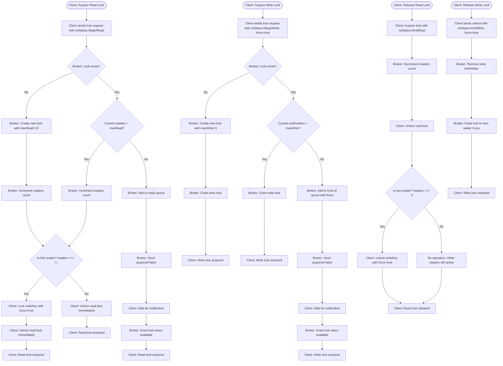

# Reader-Writer Lock Decision Tree

This document shows the decision tree for how clients and broker handle reader-writer lock acquisition and release (read-preferring implementation).

```mermaid
flowchart TD
    StartRead([Client: Acquire Read Lock]) --> SendReadReq[Client sends lock request with rwStatus=BeginRead]
    SendReadReq --> BrokerCheck{Broker: Lock exists?}
    
    BrokerCheck -->|No| CreateReadLock[Broker: Create new lock with maxRead=10]
    CreateReadLock --> IncrementReaders1[Broker: Increment readers count]
    IncrementReaders1 --> CheckFirstReader{Is first reader? readers === 1}
    
    BrokerCheck -->|Yes| CheckMaxRead{Current readers < maxRead?}
    CheckMaxRead -->|Yes| IncrementReaders2[Broker: Increment readers count]
    IncrementReaders2 --> CheckFirstReader
    
    CheckMaxRead -->|No| QueueRead[Broker: Add to notify queue]
    QueueRead --> SendQueued[Broker: Send acquired=false]
    SendQueued --> WaitRead[Client: Wait for notification]
    
    CheckFirstReader -->|Yes| LockWriteKey[Client: Lock writeKey with force=true]
    LockWriteKey --> UnlockRead1[Client: Unlock read lock immediately]
    UnlockRead1 --> ClientReadSuccess1[Client: Read lock acquired]
    
    CheckFirstReader -->|No| UnlockRead2[Client: Unlock read lock immediately]
    UnlockRead2 --> ClientReadSuccess2[Client: Read lock acquired]
    
    WaitRead --> GrantRead[Broker: Grant lock when available]
    GrantRead --> ClientReadSuccess3[Client: Read lock acquired]
    
    StartWrite([Client: Acquire Write Lock]) --> SendWriteReq[Client sends lock request with rwStatus=BeginWrite, force=true]
    SendWriteReq --> BrokerCheck2{Broker: Lock exists?}
    
    BrokerCheck2 -->|No| CreateWriteLock[Broker: Create new lock with maxWrite=1]
    CreateWriteLock --> GrantWrite1[Broker: Grant write lock]
    GrantWrite1 --> ClientWriteSuccess1[Client: Write lock acquired]
    
    BrokerCheck2 -->|Yes| CheckMaxWrite{Current lockholders < maxWrite?}
    CheckMaxWrite -->|Yes| GrantWrite2[Broker: Grant write lock]
    GrantWrite2 --> ClientWriteSuccess2[Client: Write lock acquired]
    
    CheckMaxWrite -->|No| QueueWrite[Broker: Add to front of queue with force]
    QueueWrite --> SendQueuedWrite[Broker: Send acquired=false]
    SendQueuedWrite --> WaitWrite[Client: Wait for notification]
    WaitWrite --> GrantWrite3[Broker: Grant lock when available]
    GrantWrite3 --> ClientWriteSuccess3[Client: Write lock acquired]
    
    ReleaseRead([Client: Release Read Lock]) --> LockForDecrement[Client: Acquire lock with rwStatus=EndRead]
    LockForDecrement --> DecrementReaders[Broker: Decrement readers count]
    DecrementReaders --> UnlockRead3[Client: Unlock read lock]
    UnlockRead3 --> CheckLastReader{Is last reader? readers === 0}
    
    CheckLastReader -->|Yes| UnlockWriteKey[Client: Unlock writeKey with force=true]
    UnlockWriteKey --> ClientReadReleased[Client: Read lock released]
    
    CheckLastReader -->|No| Noop1[No operation: Other readers still active]
    Noop1 --> ClientReadReleased
    
    ReleaseWrite([Client: Release Write Lock]) --> SendUnlockWrite[Client sends unlock with rwStatus=EndWrite, force=true]
    SendUnlockWrite --> RemoveWriteLockholder[Broker: Remove write lockholder]
    RemoveWriteLockholder --> NotifyNext2[Broker: Grant lock to next waiter if any]
    NotifyNext2 --> ClientWriteReleased[Client: Write lock released]
```

