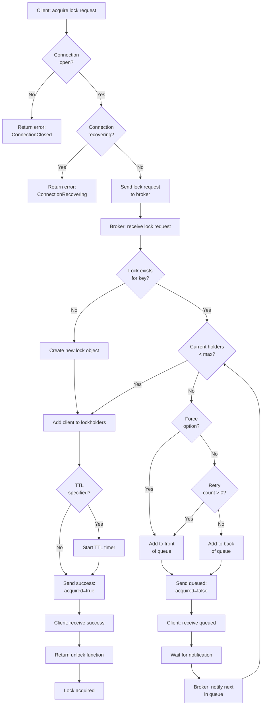
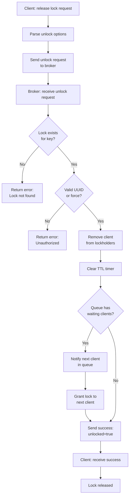

# Standard Lock Decision Tree

This document shows the decision flow for how clients and the broker handle standard (non-reader-writer) lock acquisition and release.

## Acquire Lock Flow

## Release Lock Flow

