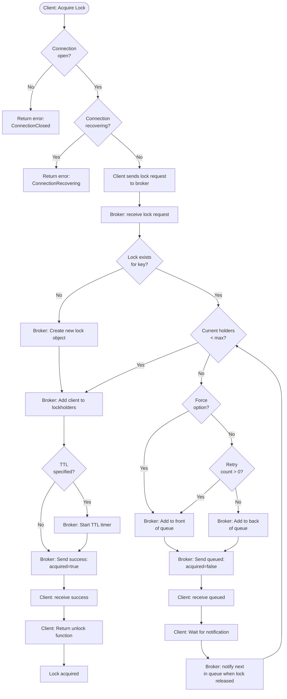
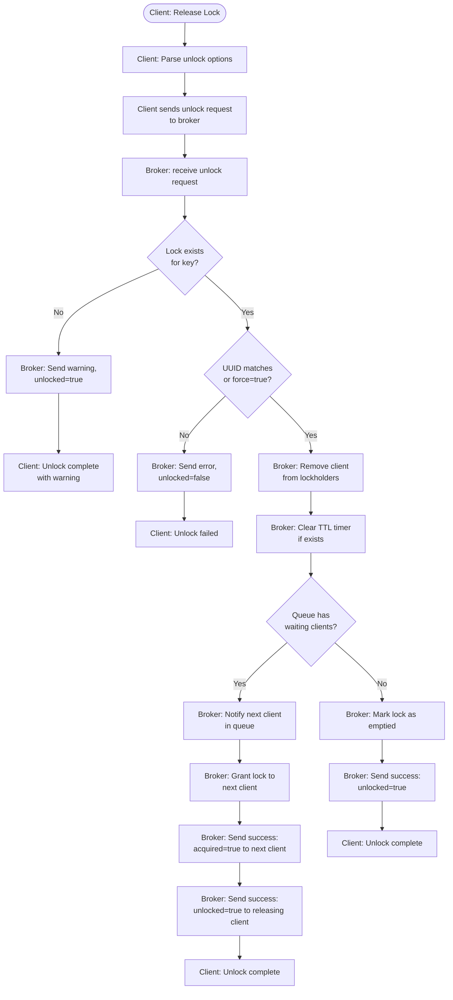

# Standard Lock Decision Tree

This document shows the complete decision flow for how clients and the broker handle standard (non-reader-writer) lock acquisition and release, including both client-side validation and broker-side processing.

## Acquire Lock Flow

## Release Lock Flow

