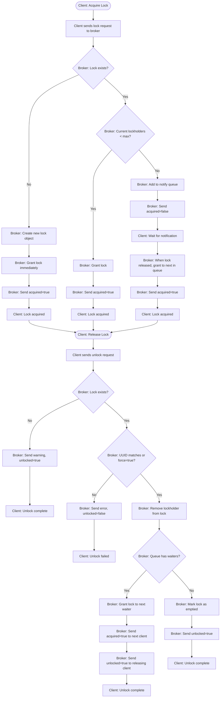

# Standard Lock Decision Tree

This document shows the decision tree for how clients and broker handle standard lock acquisition and release.

```mermaid
flowchart TD
    Start([Client: Acquire Lock]) --> SendReq[Client sends lock request to broker]
    SendReq --> BrokerCheck{Broker: Lock exists?}
    
    BrokerCheck -->|No| CreateLock[Broker: Create new lock object]
    CreateLock --> GrantLock1[Broker: Grant lock immediately]
    GrantLock1 --> SendSuccess1[Broker: Send acquired=true]
    SendSuccess1 --> ClientSuccess1[Client: Lock acquired]
    
    BrokerCheck -->|Yes| CheckMax{Broker: Current lockholders < max?}
    
    CheckMax -->|Yes| GrantLock2[Broker: Grant lock]
    GrantLock2 --> SendSuccess2[Broker: Send acquired=true]
    SendSuccess2 --> ClientSuccess2[Client: Lock acquired]
    
    CheckMax -->|No| QueueRequest[Broker: Add to notify queue]
    QueueRequest --> SendQueued[Broker: Send acquired=false]
    SendQueued --> ClientWait[Client: Wait for notification]
    ClientWait --> WaitForLock[Broker: When lock released, grant to next in queue]
    WaitForLock --> SendSuccess3[Broker: Send acquired=true]
    SendSuccess3 --> ClientSuccess3[Client: Lock acquired]
    
    ClientSuccess1 --> Release([Client: Release Lock])
    ClientSuccess2 --> Release
    ClientSuccess3 --> Release
    
    Release --> SendUnlock[Client sends unlock request]
    SendUnlock --> BrokerCheck2{Broker: Lock exists?}
    
    BrokerCheck2 -->|No| SendWarning[Broker: Send warning, unlocked=true]
    SendWarning --> ClientDone1[Client: Unlock complete]
    
    BrokerCheck2 -->|Yes| CheckUUID{Broker: UUID matches or force=true?}
    
    CheckUUID -->|No| SendError[Broker: Send error, unlocked=false]
    SendError --> ClientError[Client: Unlock failed]
    
    CheckUUID -->|Yes| RemoveLockholder[Broker: Remove lockholder from lock]
    RemoveLockholder --> CheckQueue{Broker: Queue has waiters?}
    
    CheckQueue -->|Yes| NotifyNext[Broker: Grant lock to next waiter]
    NotifyNext --> SendSuccess4[Broker: Send acquired=true to next client]
    SendSuccess4 --> SendUnlockSuccess[Broker: Send unlocked=true to releasing client]
    SendUnlockSuccess --> ClientDone2[Client: Unlock complete]
    
    CheckQueue -->|No| MarkEmptied[Broker: Mark lock as emptied]
    MarkEmptied --> SendUnlockSuccess2[Broker: Send unlocked=true]
    SendUnlockSuccess2 --> ClientDone3[Client: Unlock complete]
```

